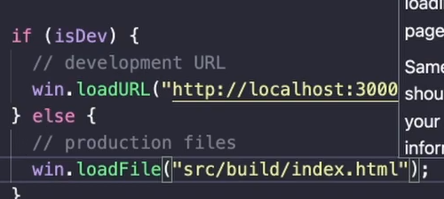

# Electron app with React ❤️‍🔥

## Getting started:

- Create a basic electron app as you would normally do, but don't create index.html file.
- After that create the react app using `npx create-react-app my-app`

- Now, in `package.json` file, we need to make a few changes:

```json
{
	"name": "electron_app_with_react",
	"version": "1.0.0",
	"description": "",
	"main": "main.js",

	"homepage": "./",

	"scripts": {
		"test": "echo \"Error: no test specified\" && exit 1",
		"start": "concurrently \" cd react_app && npm start\" \"electron .\" "
	},
	"keywords": [],
	"author": "Deependu Jha",
	"license": "ISC",
	"devDependencies": {
		"electron": "^23.1.3"
	},
	"dependencies": {
		"concurrently": "^7.6.0"
	}
}
```

#### `"homepage": "./"` is the only thing that will make the react app work in electron (in production mode).

---

- Now, write your react app in `react_app` folder and then run `npm start` to start the electron app with react.

- We can also install tailwindcss in the react app and use it in the electron app.

---

## Check if the electron app is working in production mode:

- This is a very useful package to check if the electron app is running in production mode or development mode.


```sh
npm i electron-is-dev
```

```js
const isDev = require('electron-is-dev');

if (isDev) {
	console.log('Running in development');
} else {
	console.log('Running in production');
}
```